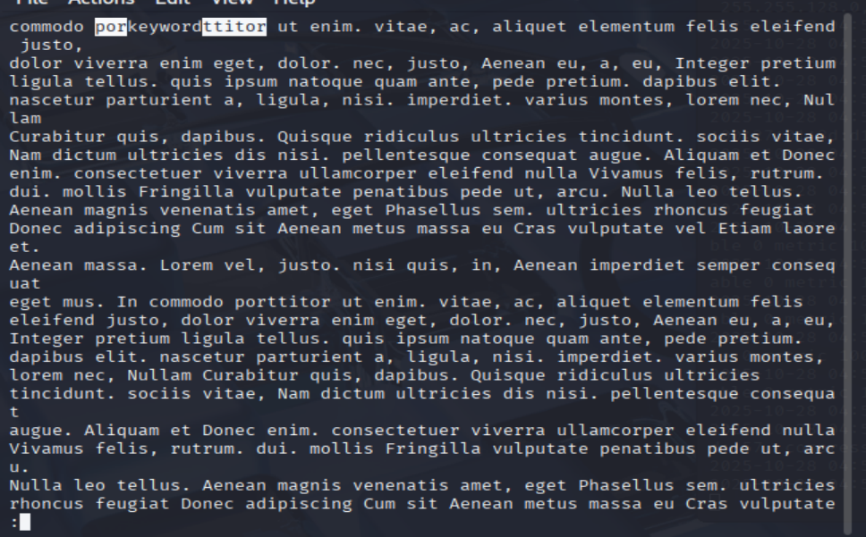
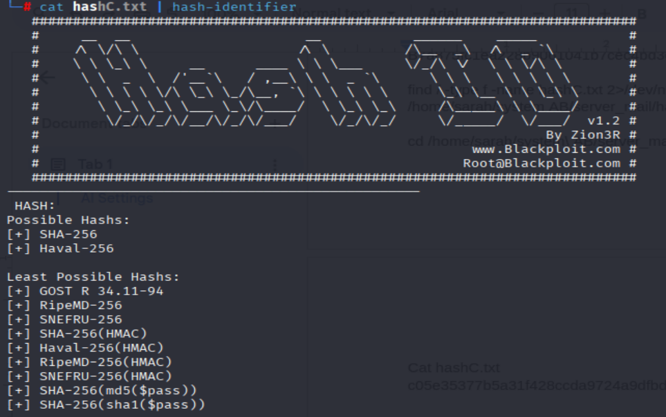
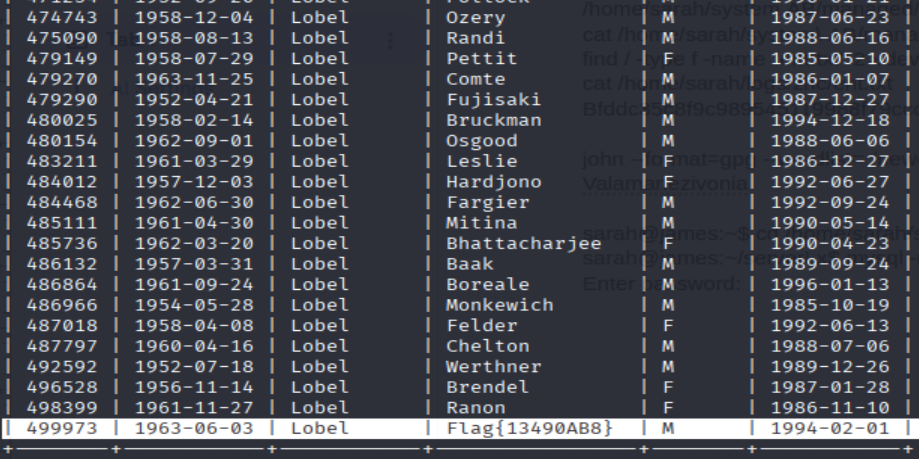

# Linux Strength Training - TryHackMe

Guided room for beginners to learn/reinforce linux command line skills

## Overview

- **Room URL:** [https://tryhackme.com/room/linuxstrengthtraining](https://tryhackme.com/room/linuxstrengthtraining)
- **Difficulty:** Easy
- **Time to complete:** 45

## Walkthrough

### 1. Intro

_No answer needed!_

### 2. Finding your way around linux - overview

- <p>What is the correct option for finding files based on group<br /></p>

**=> Answer: `-group`**

- What is format for finding a file with the user named Francis and with a size of 52 kilobytes in the directory /home/francis/

**=> Answer: `find /home/francis -type f -user Francis -size 52k`**

- <p>SSH as <b>topson</b> using his password <b>topson</b>. Go to the /home/topson/chatlogs directory and type the following: grep -iRl 'keyword'. What is the name of the file that you found using this command?<br /></p>

```bash
cd /home/topson/chatlogs

grep -iRl 'keyword'
```


**=> Answer: `2019-10-11`**

- <p>What are the characters subsequent to the word you found?<br /></p>

```bash
less 2019-10-11

/keyword -> [ENTER]
```



**=> Answer: `ttitor`**

- <p>Read the file named 'ReadMeIfStuck.txt'. What is the Flag?<br /></p>
- Let's find the `ReadMeIfStuck.txt` file first and see its content

```bash
find / -type f -name ReadMeIfStuck.txt 2>/dev/null

cat /home/topson/ReadMeIfStuck.txt
```


- It tells us to look up the `additionalHINT`:

```bash
find / -type f -name additionalHINT 2>/dev/null

cat /home/topson/channels/additionalHINT
```


- It also tells us to look up the `telephone numbers` directory:

```bash
find / -type d -name "telephone numbers" 2>/dev/null

cd /home/topson/corperateFiles/xch/telephone\ numbers/

cat readME.txt
```


- It tells us to find a file that is modified in the date 2016-09-12, so I search file that is modified from 2016-09-11 to 2016-09-13:

```bash
find /home/topson/workflows -type f -newermt 2016-09-11 ! -newermt 2016-09-13
```


- Found `eBQRhHvx` file, its content is really long so I use `less` command and search for pattern like previous question:

```bash
less eBQRhHvx

/Flag -> [ENTER]
```


**=> Answer: `Flag{81726350827fe53g}`**

### 3. Working with files

- <p>Hypothetically, you find yourself in a directory with many files and want to move all these files to the directory of /home/francis/logs. What is the correct command to do this?<br /></p>

**=> Answer: `mv * /home/francis/logs`**

<p>Hypothetically, you want to transfer a file from your /home/james/Desktop/ with the name script.py to the remote machine (192.168.10.5) directory of /home/john/scripts using the username of john. What would be the full command to do this?<br /></p>

**=> Answer: `scp /home/james/Desktop/script.py john@192.168.10.5:/home/john/scripts`**

- <p>How would you rename a folder named -logs to -newlogs<br /></p>

**=> Answer: `mv -- -logs -newlogs`**

- <p>How would you copy the file named encryption keys to the directory of /home/john/logs<br /></p>

**=> Answer: `cp "encryption keys" /home/john/logs`**

- <p>Find a file named readME_hint.txt inside topson's directory and read it. Using the instructions it gives you, get the second flag.<br /></p>
- First find the `readME_hint.txt` inside the topson's directory

```bash
find /home/topson -type f -name 'readME_hint.txt'

cd /home/topson/corperateFiles/RecordsFinances/

cat readME_hint.txt
```


- Let's follow the instructions, move the `-MoveME.txt` then run the `-runME.sh`:

```bash
mv -- '-MoveMe.txt' '-march folder'

cd -- '-march folder'

bash -- '-runME.sh'
```


**=> Answer: `Flag{234@i4s87u5hbn$3}`**

### 4. Hashing - introduction

- Download the hash file attached to this task and attempt to crack the MD5 hash. What is the password?<br />
- Crack the downloaded hash with `john the ripper`:

```bash
john --format=raw-md5 --wordlist=/usr/share/wordlists/rockyou.txt ./hash1_1601657952696.txt
```


**=> Answer: `secret123`**

- <p>SSH as <b>sarah</b> using: sarah@[MACHINE_IP] and use the password: <b>rainbowtree1230x</b><span style="font-size:11.0pt;line-height:107%;font-family:&quot;Calibri&quot;,sans-serif;mso-ascii-theme-font:minor-latin;mso-fareast-font-family:Calibri;mso-fareast-theme-font:minor-latin;mso-hansi-theme-font:minor-latin;mso-bidi-font-family:&quot;Times New Roman&quot;;mso-bidi-theme-font:minor-bidi;mso-ansi-language:EN-GB;mso-fareast-language:EN-US;mso-bidi-language:AR-SA"></span> </p><p>What is the hash type stored in the file hashA.txt<br /></p>

```bash
$ find / -type f -name hashA.txt 2>/dev/null
/home/sarah/system AB/server_mail/server settings/hashA.txt

$ cd /home/sarah/system\ AB/server_mail/server\ settings
$ cat hashA.txt
f9d4049dd6a4dc35d40e5265954b2a46
```

- I use [CrackStation](https://crackstation.net) to crack this hash:


**=> Answer: `md4`**

- Crack hashA.txt using john the ripper, what is the password?<br />

**=> Answer: `admin`**

- <p>What is the hash type stored in the file hashB.txt</p>

```bash
$ find / -type f -name hashB.txt 2>/dev/null
/home/sarah/oldLogs/settings/craft/hashB.txt

$ cat /home/sarah/oldLogs/settings/craft/hashB.txt
b7a875fc1ea228b9061041b7cec4bd3c52ab3ce3
```


**=> Answer: `sha-1`**

- Find a wordlist  with the file extention of '.mnf' and use it to crack the hash with the filename hashC.txt. What is the password?<br />

```bash
$ find / -type f -name hashC.txt 2>/dev/null
/home/sarah/system AB/server_mail/hashC.txt

$ cd /home/sarah/system\ AB/server_mail/
$ cat hashC.txt
c05e35377b5a31f428ccda9724a9dfbd0c5d71dccac691228d803c78e2e8da29
```

- I copy the value to my hash to a file to local machine:

```bash
$ echo "c05e35377b5a31f428ccda9724a9dfbd0c5d71dccac691228d803c78e2e8da29" >> hashC.txt
$ cat hashC.txt | hash-identifider
```



- I found it is `sha-256 type`, now I have to download the `ww.mnf` wordlist to my local machine and use `john-the-ripper` to crack the hash:

```bash
$ scp sarah@10.10.87.214:/home/sarah/system\ AB/db/ww.mnf ./
$ john --format=raw-sha256 --wordlist=./ww.mnf ./hashC.txt
```


**=> Answer: `unacvaolipatnuggi`**

- <p>Crack hashB.txt using john the ripper, what is the password?</p>

**=> Answer: `letmein`**

### 5. Decoding base64

- what is the name of the tool which allows us to decode base64 strings?<br />

**=> Answer: `base64`**

- <p>find a file called encoded.txt. What is the special answer?<br /></p>

```bash
$ find / -type f -name "encoded.txt" 2>/dev/null
/home/sarah/system AB/managed/encoded.txt

$ cat /home/sarah/system\ AB/managed/encoded.txt | base64 -d | less
```

- This is a really large file so I use `less` then find the pattern `/special`, I found a hint:


```bash
$ find / -type f -name "ent.txt" 2>/dev/null
$ cat /home/sarah/logs/zhc/ent.txt
bfddc35c8f9c989545119988f79ccc77
```


**=> Answer: `john`**

### 6. Encryption/Decryption using gpg

- You wish to encrypt a file called history_logs.txt using the AES-128 scheme. What is the full command to do this?<br />

**=> Answer: `gpg --cipher-algo AES-128 --symmetric history_logs.txt`**

- What is the command to decrypt the file you just encrypted?<br />

**=> Answer: `gpg history_logs.txt.gpg`**

- <p>Find an encrypted file called layer4.txt, its password is bob. Use this to locate the flag. What is the flag?<br /></p>

**=> Answer: `Flag{B07$f854f5ghg4s37}`**

### 7. Cracking encrypted gpg files

- Find an encrypted file called personal.txt.gpg and find a wordlist called data.txt. Use tac to reverse the wordlist before brute-forcing it against the encrypted file. What is the password to the encrypted file?<br />
- You have to find `personal.txt.gpg` and `data.txt` you may need to download it to your local machine in order to work with it, then:

```bash
tac data.txt > newdata.txt
gpg2john personal.txt.gpg > personal.txt

john --format=gpg --wordlist=./newdata.txt ./personal.txt
```


**=> Answer: `valamanezivonia`**

- What is written in this now decrypted file?<br />

```bash
gpg ./personal.txt.gpg

# Type valamanezivonia in the paraphrase

cat ./personal.txt
```


**=> Answer: `getting stronger in linux`**

### 8. Reading SQL databases

- Find a file called employees.sql and read the SQL database. (Sarah and Sameer can log both into mysql using the password: password). Find the flag contained in one of the tables. What is the flag?

```bash
$ cd /home/sarah/serverLx
$ mysql -u sarah -p
# Password: password

mysql > source employees.sql;
mysql > use employees;
mysql > select * from employees where first_name LIKE 'Lobel' or last_name LIKE 'Lobel';
```



**=> Answer: `Flag{13490AB8}`**

### 9. Final Challenge

- <p>What is Sameer's SSH password?<br /></p>

```bash
grep -iR "SSH"
```


**=> Answer: `thegreatestpasswordever000`**

- <p>What is the password for the sql database back-up copy<br /></p>

```bash
cat KfnP
```

- You will see the hint that the back-up copy based in `/home/shared/sql/conf`, the file is `50MB`:

```bash
ls -lah /home/shared/sql/confg
```

```bash
ssh sameer@10.10.24.85

cd /home/sameer/History\ LB/labmind/latestBuild/configBDB/
grep -iRI 'ebq'
```


**=> Answer: `ebqattle`**

- Find the SSH password of the user James. What is the password?<br />

**=> Answer: `vuimaxcullings`**

- <p>What is the root flag?<br /></p>

```bash
ssh james@10.10.24.85

# Password: vuimaxcullings

sudo -i

# Password: vuimaxcullings

ls
cat root.txt
```


**=> Answer: `Flag{6$8$hyJSJ3KDJ3881}`**
