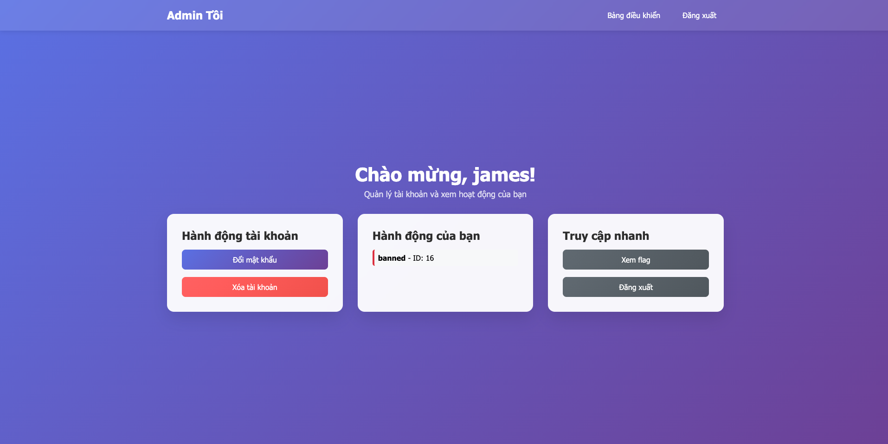
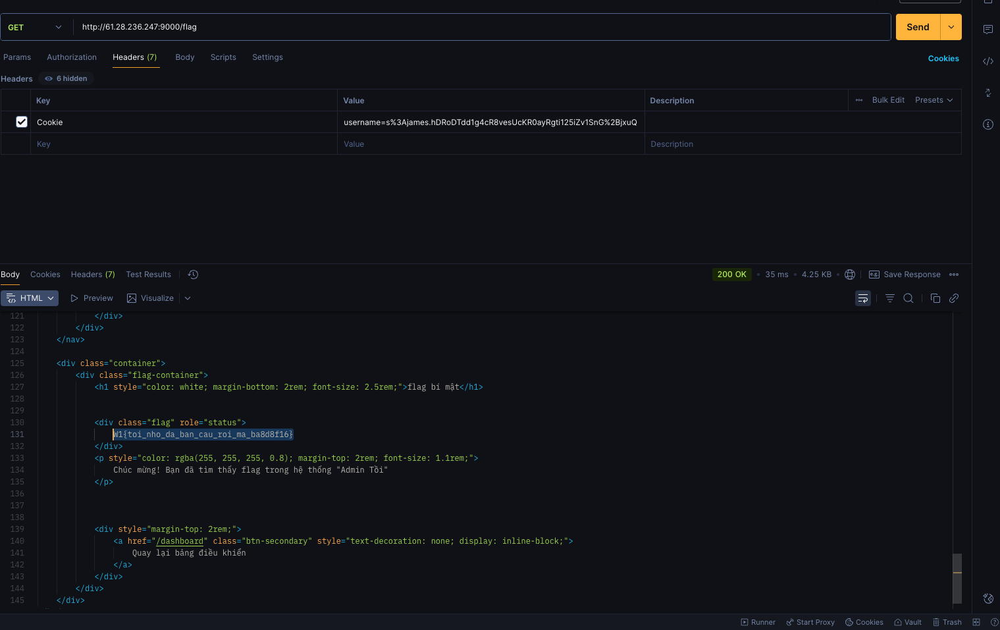

# Admin Tồi — WannaGame Freshman CTF 2025

> **Room / Challenge:** Admin Tồi (Web)

---

## Metadata

- **Author:** `jameskaois`
- **CTF:** WannaGame Freshman CTF 2025
- **Challenge:** Admin Tồi (web)
- **Target / URL:** `http://61.28.236.247:9000/`
- **Difficulty:** `Medium`
- **Points:** `419`
- **Solves:** `10`
- **Date:** `06-10-2025`

---

## Goal

We have to get the flag by leveraging the vuln in authentication feature

## My Solution

Here is the source code, you can download and examine it [here](./admin_toi.zip)

This is the home page of the website.


Let's try creating an account and logging in to it to see what we got.

```
Username: james
Password: 123
```

This is the interface of the `/dashboard` page.



Visit `/flag` to see if we can get the flag (of course not :)) )


Now, let's examine the code to see what vulnerability we can take advantage of. The website just have one file `app.js`.

After some time looking at the code and investigating the functionalities, I figured out there are 3 routes we have to focus on `/register`, `/delete_account` and `/flag`.

The `/register` route besides the user creating functionality it also use `admin_action` functionality to insert into `ACTION` a row that will prevent us from viewing the flag.

```javascript
function admin_action(
  username,
  action_name = "accepted",
  reason = "No reason provided"
) {
  db.run(
    "INSERT INTO Action (username, action_name, reason) VALUES (?, ?, ?)",
    [username, action_name, reason]
  );
}

app.post("/register", (req, res) => {
  const { username, password, confirm_password } = req.body;

  if (!username || !password) {
    return res.render("register", {
      error: "Tên đăng nhập và mật khẩu là bắt buộc.",
    });
  }

  if (password !== confirm_password) {
    return res.render("register", { error: "Mật khẩu không khớp." });
  }

  db.run(
    "INSERT INTO User (username, password) VALUES (?, ?)",
    [username, password],
    function (err) {
      if (err) {
        if (err.message.includes("UNIQUE constraint failed")) {
          return res.render("register", { error: "Tên đăng nhập đã tồn tại." });
        }
        return res.render("register", { error: "Lỗi đăng ký." });
      }
      // How annoyed admin is at new user
      admin_action(username, "banned", "Thích thế");
      res.render("login", {
        success: "Đăng ký thành công! Vui lòng đăng nhập.",
      });
    }
  );
});
```

The `/delete_account` route besides delete our account from the `User` table but also delete the row about our user in `Action` table.

```javascript
app.post("/delete_account", loginRequired, (req, res) => {
  const username = req.signedCookies.username;

  // Simplified - no password verification as requested
  db.run("DELETE FROM User WHERE username = ?", [username], (err) => {
    if (err) {
      return res.render("delete_account", { error: "Lỗi xóa tài khoản." });
    }
    res.clearCookie("username");
    res.render("index", {
      success: "Tài khoản đã được xóa thành công.",
      layout: true,
    });
  });
});
```

The `/flag` route will check if our account contains in `Action` table with `action_name: banned`. If yes, it will prevent us from viewing the flag, otherwise it will show us the flag.

```javascript
app.get("/flag", loginRequired, (req, res) => {
  const username = req.signedCookies.username;
  db.get(
    'SELECT * FROM Action WHERE username = ? AND action_name = "banned"',
    [username],
    (err, row) => {
      if (err) {
        return res.render("flag", { layout: false });
      }
      if (row) {
        return res.render("flag", {
          message: "Tài khoản của bạn đã bị cấm.",
          banned: row,
          layout: false,
        });
      } else {
        return res.render("flag", {
          message: "Chúc mừng! Bạn không bị cấm.",
          banned: false,
          flag: process.env.FLAG ?? "W1{test_flag}",
          layout: false,
        });
      }
    }
  );
});
```

The website uses cookie to authenticate user. We can easily see that by inspecting the website.


In `/flag` route, we can see that we just need to pass the `loginRequired` middleware in order to get access to flag.

```javascript
function loginRequired(req, res, next) {
  if (!req.signedCookies.username) {
    return res.redirect("/login");
  }
  next();
}
```

The flow is this:

1. Create an account, copy the cookie `username` to Postman or Burp Suite.
2. Delete that account.
3. Access to the flag with that cookie.

By this flow, we can pass the `loginRequired` middleware and also pass the check of `Action` table if there is a row in that table, which prevents us from viewing the flag.



The flag is `W1{toi_nho_da_ban_cau_roi_ma_ba8d8f16}`
