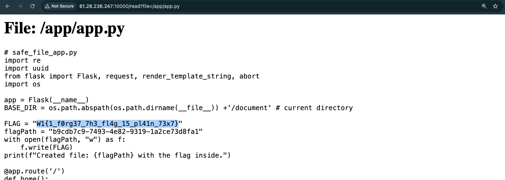

# Open Read Flag — WannaGame Freshman CTF 2025

> **Room / Challenge:** Open Read Flag (Web)

---

## Metadata

- **Author:** `jameskaois`
- **CTF:** WannaGame Freshman CTF 2025
- **Challenge:** Open Read Flag (web)
- **Target / URL:** `http://61.28.236.247:10000/`
- **Difficulty:** `Medium`
- **Points:** `484`
- **Solves:** `5`
- **Date:** `06-10-2025`

---

## Goal

We have to get the flag by leveraging the view file functionality.

## My Solution

Here is the source code, you can download and examine it [here](./open_read_flag.zip)

The website is simple with just a read file functionality.


In `app.py`, there is a `/read` route that enables us to view files:

```python
@app.route('/read')
def read_file():
    filename = request.args.get('file', '')
    uuid_pattern = r"[0-9a-fA-F]{8}-[0-9a-fA-F]{4}-[1-5][0-9a-fA-F]{3}-[89abAB][0-9a-fA-F]{3}-[0-9a-fA-F]{12}"
    matches = re.findall(uuid_pattern, filename)
    if matches:
        if matches[0] == flagPath :
            return f"Error : Sorry this is protected !"
    if ".." in filename  :
        return f"Error : Why the .. here ???"
    try:
        filepath = os.path.join(BASE_DIR, filename)
        with open(filepath, "r") as f:
            content = f.read()
    except Exception as e:
        return f"Error: {e}"

    return render_template_string('''
        <h1>File: {{ filename }}</h1>
        <pre>{{ content }}</pre>
        <a href="/">Go back</a>
    ''', filename=filename, content=content)
```

We have to leverage it to view the flag in this filename `b9cdb7c9-7493-4e82-9319-1a2ce73d8fa1`:

```python
FLAG = "flag{this_is_a_test_flag}"
flagPath = "b9cdb7c9-7493-4e82-9319-1a2ce73d8fa1"
with open(flagPath, "w") as f:
    f.write(FLAG)
print(f"Created file: {flagPath} with the flag inside.")
```

However, the check in `/read` prevents us from viewing the file normally, since the filename is also a uuid:

```python
uuid_pattern = r"[0-9a-fA-F]{8}-[0-9a-fA-F]{4}-[1-5][0-9a-fA-F]{3}-[89abAB][0-9a-fA-F]{3}-[0-9a-fA-F]{12}"
    matches = re.findall(uuid_pattern, filename)
    if matches:
        if matches[0] == flagPath :
            return f"Error : Sorry this is protected !"
    if ".." in filename  :
        return f"Error : Why the .. here ???"
```

We can try access it, however we will get the message `Error : Sorry this is protected !`


I tried loads of payloads, with URL encoding and several methods however still cannot achieve the flag.

Finally, I think of a way that we cannot directly view the `b9cdb7c9-7493-4e82-9319-1a2ce73d8fa1` file, but via the `app.py`.

Because the `app.py` is located inside the `app` folder from route so we can view it through this param `?file=/app/app.py`:



Flag is: `W1{1_f0rg37_7h3_fl4g_15_pl41n_73x7}`
